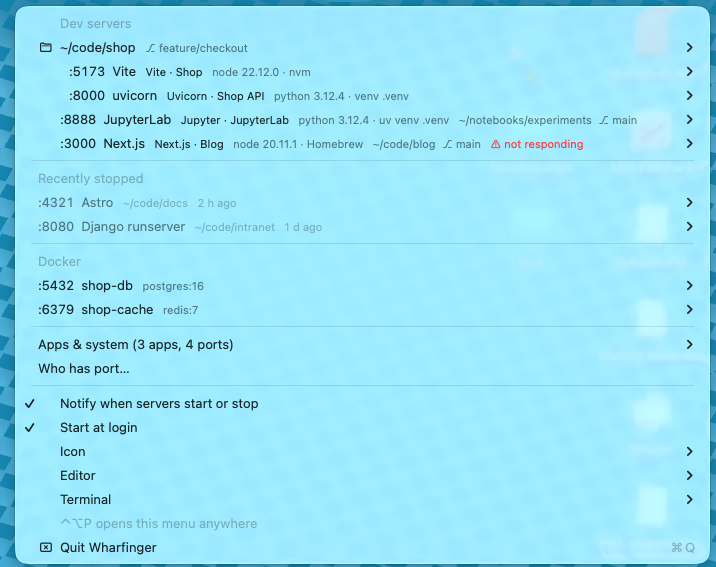

# Wharfinger

See what is listening on localhost, what answers there, and open, kill or restart it.
For macOS. A menu bar app plus a `wharf` terminal command, no dependencies beyond what ships with macOS.

<br clear="left">



```
:5173     Vite            Vite · My App          node 22.20.0 · nvm             ~/code/my-app
:8765     uvicorn         Uvicorn · API docs     python 3.12.3 · venv .venv     ~/code/api
:9000 +5  Jupyter kernel                         python 3.13.14 · uv venv       ~/notebooks
:5432     docker:pg       postgres:16
```

## Install

Wharfinger is built from source on your own Mac. It takes about twenty seconds and needs nothing but
the Xcode Command Line Tools (`xcode-select --install` if you don't have them).

**With Homebrew:**

```
brew install svidmar/tap/wharfinger
cp -R "$(brew --prefix)/opt/wharfinger/Wharfinger.app" ~/Applications/ && open ~/Applications/Wharfinger.app
```

The first line builds the app and installs the `wharf` command; the second puts the app where Spotlight,
"Start at login" and notifications expect it. `brew upgrade wharfinger` updates both (repeat the copy).

**From a clone:**

```
git clone https://github.com/svidmar/wharfinger.git
cd wharfinger
./build.sh --install     # menu bar app  → ~/Applications/Wharfinger.app, launched
./install.sh             # terminal command → ~/.local/bin/wharf
```

Building locally is what makes the app run without a Gatekeeper warning: macOS trusts apps you compiled
yourself, but a prebuilt download would have to be notarised by Apple. There is no prebuilt download for that reason.
To update, `git pull` and run `./build.sh --install` again. To uninstall, quit it from the menu and delete
`~/Applications/Wharfinger.app` and `~/Library/Application Support/Wharfinger`.

## Menu bar app

- The icon shows how many dev servers and containers are listening. Click it for the list.
- Each row: port, program, what answers on it (framework · page title), runtime and environment, project directory
  and its git branch (worktrees included).
- Servers in the same directory (a frontend and its API, say) are grouped under a project row with the branch.
- **Start again**: servers Wharfinger has seen are remembered with their exact command, directory and environment,
  so a "Recently stopped" section lets you start them again later, even after a reboot. Remembered servers live in
  `~/Library/Application Support/Wharfinger/servers.json` (readable only by you, since it can hold environment variables).
- **Not responding**: a server that used to answer HTTP but no longer does is flagged in red with a Restart
  shortcut, and you get a notification. Processes that never spoke HTTP (Jupyter kernel ports, databases) are left alone.
- **Known routes**: FastAPI/Uvicorn get "Open /docs" and "/redoc", Django "/admin/", Jupyter "/lab", Rails
  "/rails/info/routes", Phoenix "/dev/dashboard", Ollama "/api/tags" and so on, right under Open.
- **Environment per server**: which python/node/ruby… and version, and where it comes from: a `.venv`
  (plain, uv or poetry), conda env, pyenv, nvm, fnm, volta, asdf, mise, Homebrew, python.org, system.
  Read from the process' real executable path and environment, so it works even when the venv was never
  "activated" (`.venv/bin/python -m uvicorn …`). The submenu shows the venv path, base interpreter and
  relevant variables like `NODE_ENV` or `DJANGO_SETTINGS_MODULE`.
- The program is recognised from the command line: uvicorn, gunicorn, Django, Flask, Vite, Next.js, Jupyter,
  Jupyter kernels, Streamlit … A process with many ports (a Jupyter kernel has five) is one row.
- Submenu per server: **Open** in browser, **Copy URL**, **Open project in \<editor\>**, **Open project in…**
  (any other installed editor), **Open project in \<terminal\>**, **Reveal in Finder**, **Restart**, **Kill**, **Force Kill**.
- Pick the default editor and terminal under **Editor** / **Terminal**. Installed ones are detected
  (VS Code, Cursor, Zed, Windsurf, Sublime Text, JetBrains IDEs, Nova, TextMate, BBEdit, Emacs, Xcode, Positron, RStudio;
  Terminal, iTerm, Ghostty, Warp, kitty, Alacritty, WezTerm) and **Choose another app…** lets you pick anything else.
- **Restart** stops the process and runs the exact same command again, in the same directory
  with the same environment, in a new Terminal window so you can see its output.
- Docker containers with published ports get their own section: Open, Copy URL, Stop, Restart.
- **Who has port…** looks up a single port and offers Open / Kill. For the "address already in use" moment.
- Notifications when a dev server or container starts or stops. Click a "started" notification to open it.
  Toggle in the menu; macOS asks for notification permission on first launch.
- **⌃⌥P** pops the menu up at the mouse, handy on a notch MacBook when the menu bar is too full to show the icon.
- Pick the menu bar icon under **Icon**. **Start at login** registers it as a login item.

Apps and system processes (Spotify, Dropbox, Control Center …) are folded into an "Apps & system" submenu,
one row per app with its ports, so the list stays about your servers. A process counts as an app when its executable lives in
/Applications, /System, /Library or ~/Library.

Requires macOS 13 or newer and the Xcode Command Line Tools (for `swiftc`). Source: `Wharfinger/main.swift`.
`WHARFINGER_DEBUG=1 build/Wharfinger.app/Contents/MacOS/Wharfinger` runs it in the terminal and logs
refreshes, probes and notifications.

## Terminal command

```
./install.sh              # copies wharf.py to ~/.local/bin/wharf
wharf                     # interactive list
wharf list [-d]           # plain table (-d hides apps/system processes)
wharf who 3000            # who is using :3000? process, cwd, command, what answers (exit 1 if free)
wharf open 3000           # open http://localhost:3000
wharf kill 3000 [-9]      # kill whatever listens on :3000 (docker stop for containers)
wharf restart 3000        # stop and re-run the same command in a new Terminal window
wharf restart 3000 --here # same, but run it in this terminal
wharf edit 3000           # open the project in your editor (WHARFINGER_EDITOR app name, else first installed, else $EDITOR)
wharf dir 3000            # print the project directory:  cd "$(wharf dir 3000)"
wharf recent              # remembered servers that are not running now
wharf start 3000          # start a remembered server again (same command, cwd and env)
```

`wharf who` also prints the environment (runtime and version, venv / conda / version manager, base interpreter,
executable), the git branch and the known routes. The interactive list marks servers that stopped answering HTTP.

Keys in the interactive list:

| Key | Action |
|-----|--------|
| ↑ ↓ | move |
| Enter / o | open in browser |
| c | copy URL |
| e | open project in editor |
| k / K | kill (SIGTERM / SIGKILL), asks first |
| R | restart in a new Terminal window |
| a | toggle all / dev-only |
| / | filter by port, process, command or directory |
| r | refresh (auto-refreshes every 2 s anyway) |
| q | quit |

Green process names are dev servers, yellow are apps/system, cyan are Docker containers.

## How it works

- `lsof -iTCP -sTCP:LISTEN` finds listening sockets; `ps` and `lsof -d cwd` add the command line and working directory.
- Each dev server gets one HTTP GET. The response is matched against ~30 framework fingerprints
  (Vite, Next.js, Nuxt, SvelteKit, Django, FastAPI, Uvicorn, Flask, Express, Jupyter, Ollama …) and the `<title>` is read.
- Docker rows come from `docker ps`, when the daemon is running.
- Restart and Start again read the exact argv and environment of the process via `sysctl KERN_PROCARGS2`,
  write them to a `.command` script under `~/Library/Application Support/Wharfinger/` and open it in Terminal.
- The git branch comes from reading `.git/HEAD` (following `gitdir:` files for worktrees), no git invocation.
- Only your own processes can be inspected or killed without sudo.

## License

MIT
